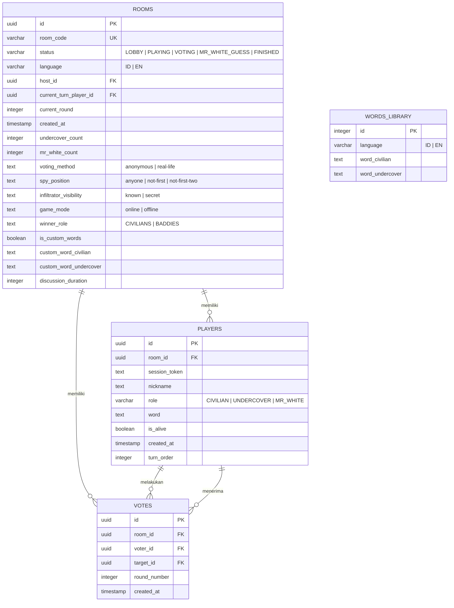

# Game Undercover Indonesia

Undercover Indonesia adalah permainan peran rahasia (social deduction game) interaktif berbasis web yang terinspirasi oleh game populer "Undercover" atau "Among Us". Game ini dimainkan secara berkelompok di mana para pemain harus menebak siapa pengkhianat di antara mereka menggunakan kata-kata petunjuk.

---

## 📖 Cara Bermain (Game Rules)

### Peran Pemain:
1. **Civilian (Warga)**:
   - Mayoritas pemain mendapatkan peran ini.
   - Mendapatkan kata rahasia yang sama (contoh: "Kucing").
   - **Tujuan**: Menemukan siapa Undercover dan Mr. White sebelum jumlah mereka menyamai jumlah warga.

2. **Undercover**:
   - Mendapatkan kata rahasia yang mirip namun berbeda dari warga (contoh: "Harimau").
   - **Tujuan**: Menyamar sebagai warga agar tidak dicurigai, bertahan hidup, dan menyingkirkan warga.

3. **Mr. White**:
   - Tidak mendapatkan kata rahasia apa pun (kosong).
   - **Tujuan**: Menyimak kata petunjuk warga, berpura-pura tahu kata warga agar tidak di-vote, dan jika tereliminasi, mendapat satu kesempatan menebak kata asli warga untuk langsung menang.

### Jalur Permainan:
1. **Lobi (Lobby)**: Host mengatur mode game (Online/Offline), jumlah Undercover & Mr. White, metode voting, visibilitas peran, dan durasi diskusi.
2. **Pembagian Kartu (Reveal Role)**: Setiap pemain melihat peran dan kata rahasianya masing-masing.
3. **Babak Diskusi**: Setiap pemain memberikan satu kata petunjuk yang mendeskripsikan kata rahasianya sesuai urutan giliran.
4. **Voting**: Pemain berdiskusi dan melakukan voting anonim (via HP masing-masing atau bergiliran satu HP) untuk mengeliminasi pemain paling mencurigakan.
5. **Mr. White Guess**: Jika Mr. White tereliminasi, dia berhak menebak kata warga. Jika tebakannya benar, Mr. White menang.
6. **Kemenangan**: Civilian menang jika semua Undercover dan Mr. White tereliminasi. Baddies (Undercover/Mr. White) menang jika jumlah warga tersisa kurang dari atau sama dengan jumlah mereka.

---

## 💻 Tech Stack & Ketergantungan (Tech Stack & Dependencies)

- **Framework Utama**: [Vue.js 3](https://vuejs.org/) (menggunakan Composition API `<script setup>`)
- **Build Tool**: [Vite](https://vitejs.dev/)
- **State Management**: [Pinia](https://pinia.vuejs.org/)
- **Routing**: [Vue Router 4](https://router.vuejs.org/)
- **Database & Realtime Backend**: [Supabase](https://supabase.com/) (menggunakan Postgres Database, Supabase Client SDK, dan Postgres Realtime Channels untuk sinkronisasi multiplayer online)
- **Styling**: Vanilla CSS dengan utilitas [TailwindCSS 3](https://tailwindcss.com/)
- **Localization (i18n)**: [Vue I18n 9](https://vue-i18n.intlify.dev/) (mendukung Bahasa Indonesia dan English)
- **Testing**: [Vitest](https://vitest.dev/) untuk unit testing logic game/store

---

## 🗄️ Skema Database (Database Schema)

Aplikasi ini menggunakan 4 tabel utama pada Postgres (Supabase):



---

## 🚀 Setup & Instalasi Project

### Prasyarat:
Pastikan Anda sudah menginstal [Node.js](https://nodejs.org/) (versi 16 atau lebih baru) dan npm.

### Langkah-langkah:
1. **Clone repositori** dan masuk ke direktori project.
2. **Instal dependensi**:
   ```bash
   npm install
   ```
3. **Konfigurasi Environment Variable**:
   Buat file `.env` di root direktori dan masukkan URL serta Anon Key Supabase Anda:
   ```env
   VITE_SUPABASE_URL=https://your-supabase-project.supabase.co
   VITE_SUPABASE_ANON_KEY=your-supabase-anon-key
   ```
4. **Setup Database (Supabase)**:
   Jalankan file SQL yang disediakan (seperti `seed_words.sql`) di panel editor SQL Supabase Anda untuk membuat tabel dan menanamkan (seed) perpustakaan kata default.
5. **Jalankan Project Secara Lokal**:
   ```bash
   npm run dev
   ```
   Aplikasi akan berjalan di `http://localhost:5173`.

---

## 🧪 Pengujian (Testing)

Project ini dilengkapi dengan unit test menggunakan **Vitest** untuk memverifikasi logika permainan.

Untuk menjalankan test:
```bash
# Menjalankan pengujian sekali (Single Run)
npm run test:unit

# Menjalankan pengujian dalam mode interaktif (Watch Mode)
npx vitest
```

---

## 📂 Struktur Folder Utama

```text
├── src/
│   ├── assets/          # File static media seperti audio .mp3
│   ├── components/      # Komponen Vue reusable
│   ├── i18n/            # Pengaturan i18n localization (ID / EN)
│   ├── router/          # Definisi routing aplikasi (index.js)
│   ├── services/        # Inisialisasi service Supabase (supabase.js)
│   ├── stores/          # Pinia Global Store (gameStore.js)
│   ├── utils/           # Utility functions seperti sound effects (sfx.js)
│   ├── views/           # Halaman/Views utama aplikasi
│   │   ├── HomeView.vue       # Halaman utama pembuatan/gabung room
│   │   ├── LobbyView.vue      # Lobi persiapan game & setelan
│   │   ├── GameplayView.vue   # Giliran deskripsi kata & diskusi
│   │   ├── VotingView.vue     # Halaman voting eliminasi
│   │   ├── GuessView.vue      # Tebakan kata oleh Mr. White
│   │   └── FinishedView.vue   # Hasil akhir pemenang game
│   ├── App.vue          # Shell komponen root
│   └── main.js          # Entrypoint aplikasi
├── vite.config.js       # Konfigurasi Vite
└── vitest.config.js     # Konfigurasi Vitest
```
