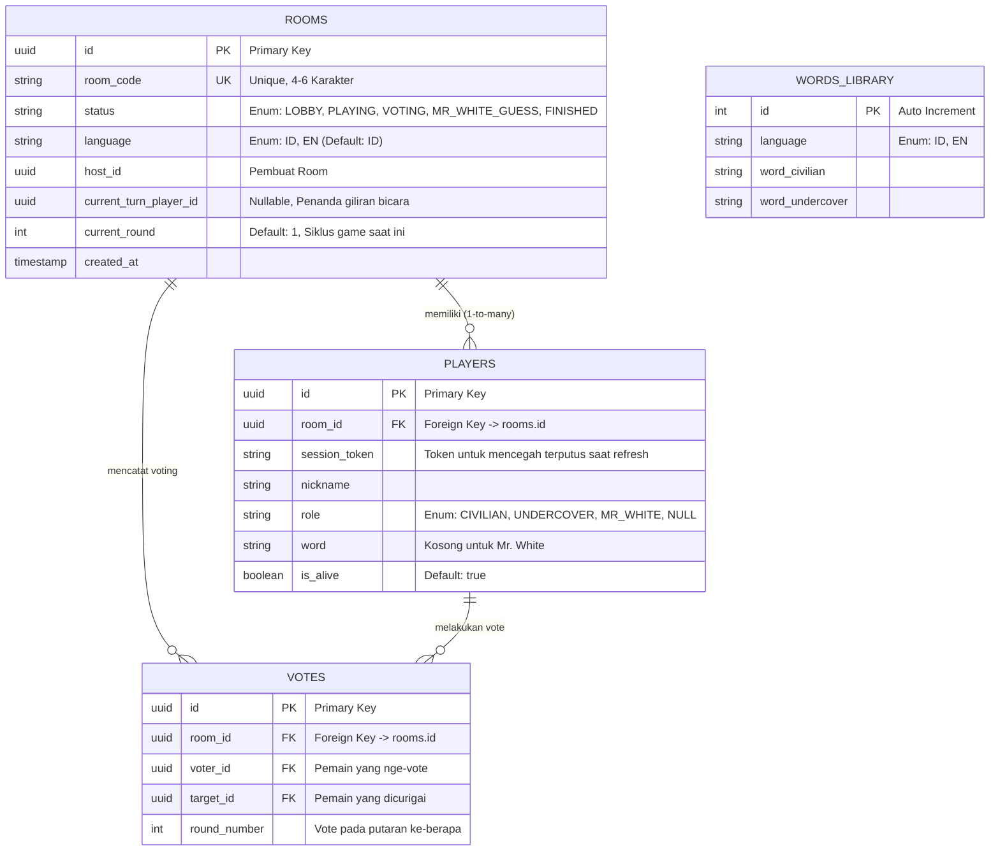

# 📋 PRODUCT REQUIREMENTS DOCUMENT (PRD)
**Project Name:** Undercover Web Game (Real-time Multiplayer)
**Target Audience:** Mobile Web Users (Party Game)
**Core Functionality:** Real-time multiplayer role-guessing game dengan fitur Bilingual.

## 1. Tech Stack
| Komponen | Teknologi | Keterangan |
| :--- | :--- | :--- |
| **Frontend** | Vue.js 3 (Composition API) + Vite | Mengatur logika UI dan state management. |
| **Localization**| Vue I18n | Mengatur pergantian bahasa UI (Indonesia/Inggris). |
| **Styling** | Tailwind CSS | Mobile-first, responsif, dan rapi. |
| **Backend & DB**| Supabase (PostgreSQL) | Menyimpan data room, player, dan daftar kata. |
| **Realtime** | Supabase Realtime & Presence | Sinkronisasi status game antar pemain tanpa *refresh*. |
| **Hosting** | Vercel | Deployment frontend secara gratis dan otomatis. |

---

## 2. Arsitektur Database & Diagram Relasi (Data Layer)
Buat 3 tabel utama di Supabase. Pastikan fitur **Realtime** diaktifkan untuk tabel `rooms` dan `players`. 

---

## 3. Logika & Aturan Permainan

**A. Pembuatan Room & Bahasa**
* Saat Host membuat room, ada opsi pilihan bahasa permainan (Indonesia/Inggris).
* UI (teks tombol, petunjuk) untuk semua pemain yang masuk ke room tersebut otomatis menyesuaikan dengan `language` dari tabel `rooms`.
* **Aturan Minimal Pemain:** Game hanya bisa dimulai (tombol Start aktif) jika jumlah pemain di room >= 4 orang.

**B. Distribusi Peran & Kata**
* Total pemain menentukan komposisi peran.
* **Wajib:** 1 orang `UNDERCOVER`.
* **Jika total pemain > 5:** Tambahkan 1 orang `MR_WHITE`.
* **Sisanya:** `CIVILIAN`.
* Ambil satu baris acak dari `words_library` **yang bahasanya sesuai dengan bahasa room** (`WHERE language = room.language`). Bagikan kata ke `CIVILIAN` dan `UNDERCOVER` sesuai peran.

**C. Sistem Giliran (Turn System)**
* **Tidak ada fitur chat.** Pemain berbicara langsung di dunia nyata.
* UI menampilkan: "Sekarang giliran [Nama Pemain]".
* Sediakan tombol **"Selesai Bicara"** di layar pemain yang mendapat giliran untuk memindahkan giliran ke pemain selanjutnya secara berurutan.

**D. Sistem Voting & Eliminasi**
* Setelah semua bicara, status room menjadi `VOTING`.
* Pemain memilih (tap) nama pemain lain yang dicurigai. Data akan masuk ke tabel `VOTES`.
* Jika semua pemain (yang masih hidup) sudah vote, sistem akan menghitung suara.
* Pemain dengan vote terbanyak akan dieliminasi (`is_alive = false`).
* **Tie-Breaker:** Jika ada hasil seri (2 orang mendapat vote tertinggi yang sama), tidak ada yang dieliminasi pada ronde tersebut.
* **Game Loop:** Jika setelah eliminasi belum ada pihak yang menang, status room kembali menjadi `PLAYING`, `current_round` bertambah 1, dan ronde bicara baru dimulai.

**E. Kondisi Kemenangan & Mekanisme Internasional Mr. White**
* **Civilian Menang:** Undercover dan Mr. White tereliminasi, ATAU Mr. White salah menebak kata.
* **Undercover Menang:** Jumlah Civilian yang hidup sama dengan atau kurang dari (Undercover + Mr. White).
* **Mr. White Menang:** Jika Mr. White tereliminasi pada fase voting, ubah status room ke `MR_WHITE_GUESS`. Munculkan input teks *hanya* di layar Mr. White. Jika tebakannya (case-insensitive) sama persis dengan kata Civilian, Mr. White otomatis memenangkan permainan.

---

## 4. Urutan Pengerjaan (Layered Architecture Guide)

Kerjakan aplikasi ini menggunakan pendekatan **Bottom-Up** agar alur data jelas dan meminimalisir *bug* saat mengurus WebSocket/Realtime.

### **Tahap 1: Data Layer (Setup Database & Supabase)**
1. Buat project baru di Supabase.
2. Buat tabel `rooms`, `players`, `votes`, dan `words_library` menggunakan SQL Editor sesuai skema ER Diagram di atas.
3. Masukkan data *dummy* ke `words_library` dalam 2 bahasa. (Contoh ID: Apel/Jeruk. Contoh EN: Apple/Orange).
4. Masuk ke menu *Replication*, aktifkan fitur *Realtime Broadcast* untuk tabel `rooms`, `players`, dan `votes`.
5. Atur Row Level Security (RLS) menjadi *allow all* untuk tahap *development*. **(Catatan Security: Di tahap production, ingat bahwa allow all akan membocorkan data `word` dan `role` pemain lain ke client, jadi harus diatur dengan RLS yang ketat).**

### **Tahap 2: Service Layer (API & Komunikasi)**
1. Inisialisasi project: `npm create vite@latest undercover-game -- --template vue`.
2. Install dependencies: `npm install @supabase/supabase-js tailwindcss pinia vue-i18n`.
3. Setup `vue-i18n` untuk translasi statis UI.
4. Buat `src/services/supabase.js` dan masukkan *URL* & *Anon Key* Supabase.
5. Buat fungsi murni untuk operasi database: `createRoom(lang)`, `joinRoom()`, `fetchWords(lang)`, dan *listener* `subscribeToRoomUpdates()`.

### **Tahap 3: State & Logic Layer (Otak Aplikasi)**
1. Setup **Pinia** di `src/stores/gameStore.js`.
2. Buat state reaktif untuk: `currentRoom`, `playersList`, `myPlayerId`.
3. Tulis *actions* Pinia untuk mengeksekusi aturan main (Distribusi Peran, Kalkulasi Voting, Ganti Giliran).
4. Pastikan data yang diterima dari *listener* Realtime Supabase (Tahap 2) langsung memperbarui state di Pinia ini.

### **Tahap 4: Presentation Layer (UI/UX)**
1. Setup **Tailwind CSS**. Terapkan prinsip **Mobile-First** (tombol besar, teks terbaca jelas di HP).
2. Buat **Komponen UI Dasar:** * Tombol, Input Teks.
    * **Tap-to-Reveal Card:** Menggunakan event `@pointerdown` (tampil kata) dan `@pointerup` (sembunyikan kata) untuk mencegah teman sebelah mengintip. **(Catatan UI/UX Mobile: Gunakan CSS `user-select: none`, `-webkit-touch-callout: none`, dan event `@contextmenu.prevent` agar menu copy/paste bawaan HP tidak muncul saat menekan kartu).**
3. **Rakit Halaman (Views - Terapkan Vue Router):**
    * `/` -> `HomeView.vue`: Bikin Room (ada toggle ID/EN) & Join Room.
    * `/room/:room_code` -> `LobbyView.vue`: Daftar pemain masuk (Gunakan *Supabase Presence* jika memungkinkan). Saat user refresh, gunakan `session_token` dari `localStorage` untuk re-join otomatis tanpa terputus.
    * `GameplayView.vue`: UI indikator giliran dan Kartu Rahasia.
    * `VotingView.vue`: Grid nama pemain untuk di-vote.
    * `GuessView.vue`: Form input khusus untuk Mr. White menebak kata.
4. Sambungkan fungsi UI dengan fungsi di `gameStore.js`.

---

## 5. Acceptance Criteria (AC)
Untuk memastikan tidak ada logika yang terlewat oleh Junior Dev / AI Agent:
* **Lobby AC:** Tombol "Start Game" hanya muncul dan bisa di-klik oleh *Host*, dan jumlah pemain di *room* harus minimal 4 orang.
* **Reconnection AC:** Jika pemain me-refresh halaman (F5) saat berada di dalam room, mereka tidak keluar dari room dan status/peran mereka tetap utuh (menggunakan pengecekan `session_token` di LocalStorage).
* **Voting AC:** Semua pemain (termasuk yang sudah mati) bisa melihat layar voting secara realtime, namun *HANYA* pemain yang `is_alive = true` yang tombol vote-nya bisa di-tap.
* **Game Loop AC:** Game dapat berulang dari status `PLAYING` -> `VOTING` -> `PLAYING` berkali-kali hingga salah satu kondisi kemenangan (Civilian / Undercover / Mr. White) tercapai.